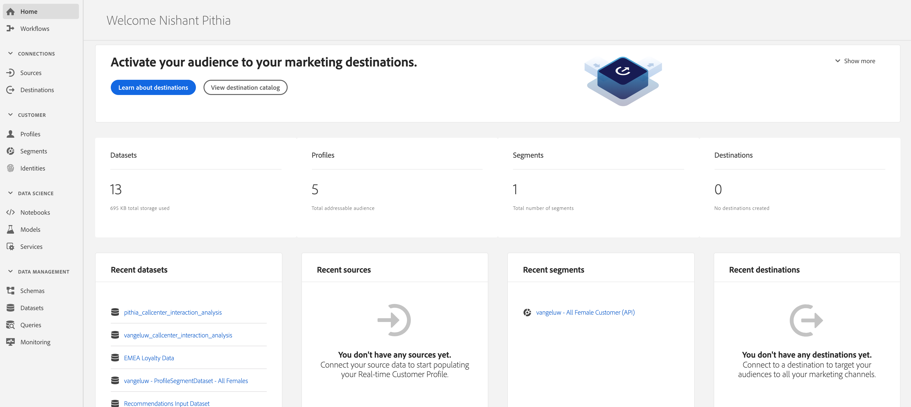
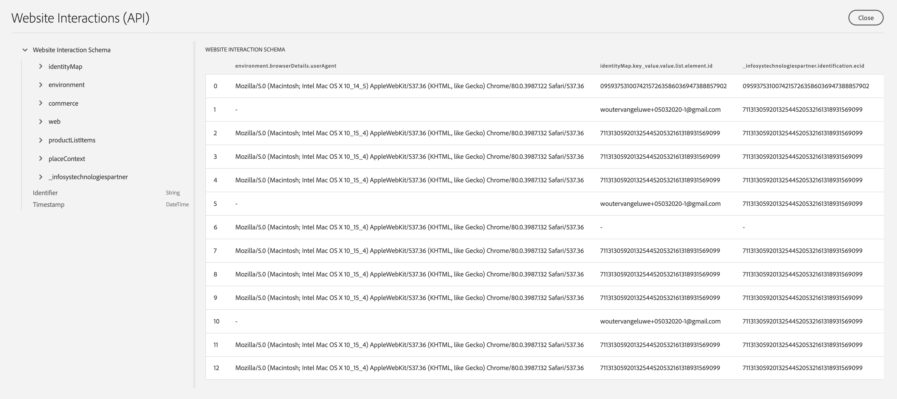
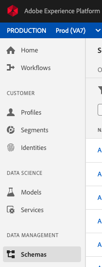
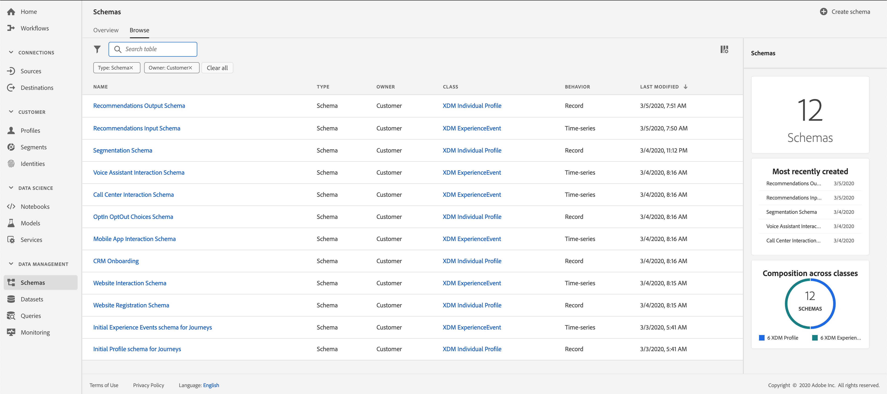
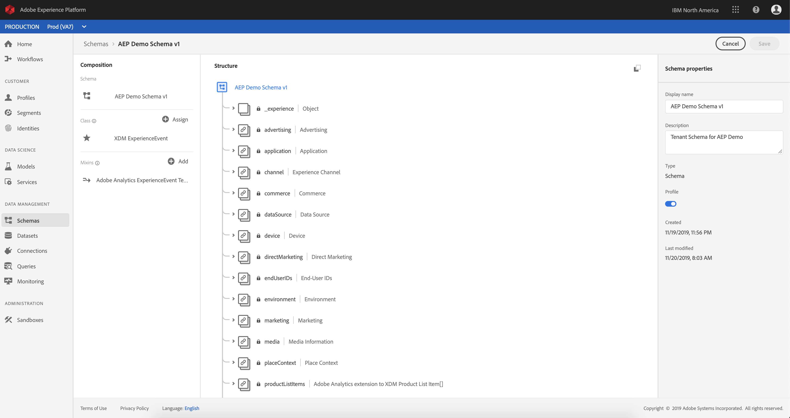
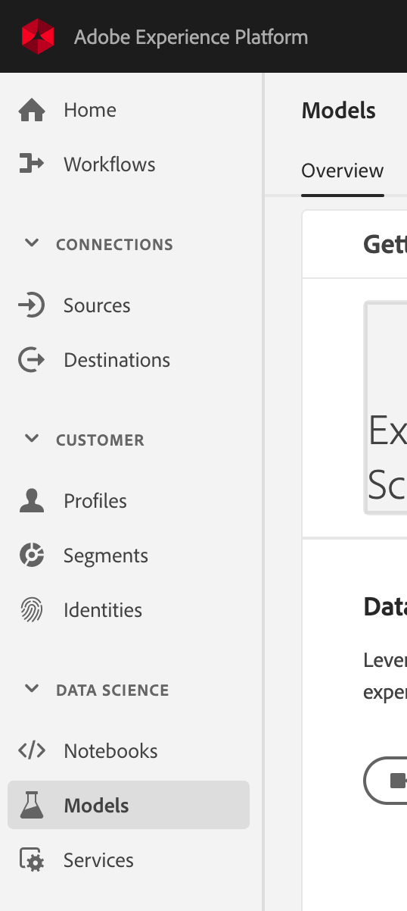
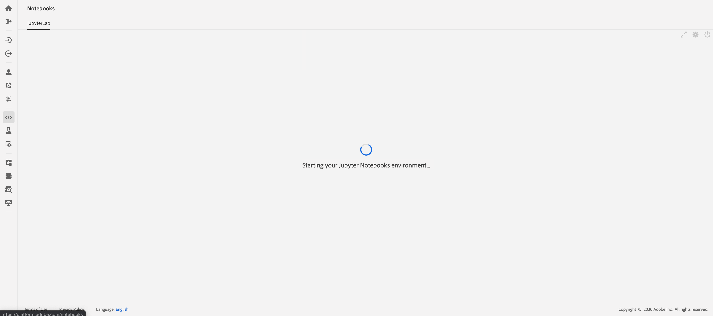
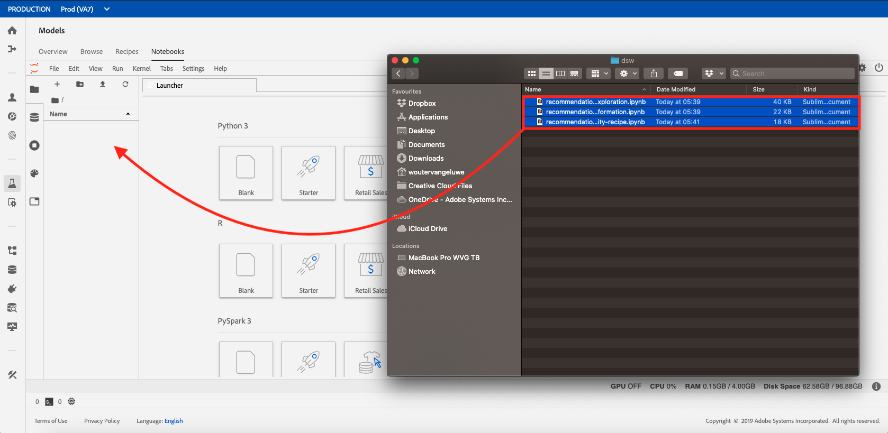
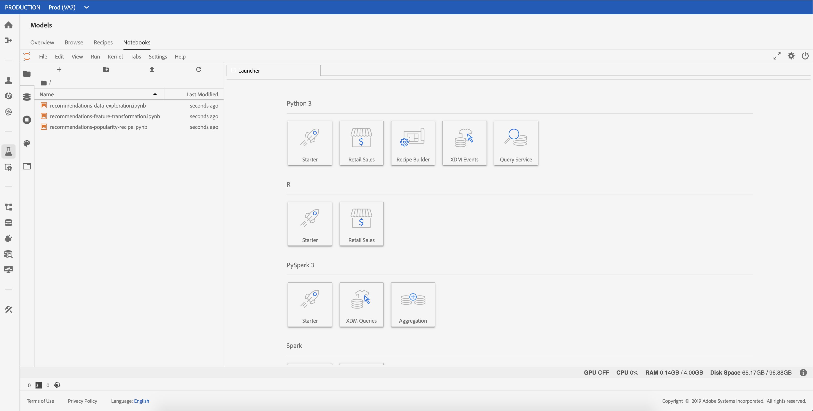

## Exercise 5.1 - Data Exploration and Transformation

To create a machine learning model that will recommend products that users might like when they are looking at a particular product, you need to analyze previous purchases made by users on the website. In this lesson, you will explore purchase data flowing via Adobe Analytics to Platform and transform that data into a Feature dataset that can help train your machine learning model.

The URL to login to Adobe Experience Platform is: [https://platform.adobe.com](https://platform.adobe.com)

### Exercise 5.1.1 - Explore the Datasets and XDM Schemas

Experience Data Models (XDM) on Adobe Experience Platform help standardize your data so that it can be used efficiently across your organization.

All interactions that are tracked on the Luma website and streamed to Adobe Experience Platform. 

Go to [https://platform.adobe.com](https://platform.adobe.com) and log in.

After logging in, you'll see the homepage of Adobe Experience Platform.



From the left menu, click ```Datasets```.

 

To develop a product recommendations machine learning model, we are interested in products that users have purchased previously with Luma. To streamline the data required to train our machine learning model, we have created a simple schema called Recommendations Input Schema as outlined in the table below (key fields: userid – the user who interacted with the Luma Website, timestamp – time of interaction, interactiontype – Purchase, itemid – product that the user interacted with).

In this Tech Lab, we'll be using 3 datasets:

| Dataset Name                   | Dataset Schema      | Description                                    |
|:---------------------------:| :---------------:| :-------------------------------------: |
| Website Interactions Dataset | Website Interaction Schema | Adobe Experience Platform source data from the Luma website |
| Recommendations Input Dataset | Recommendations Input Schema| The Analytics data is converted into a feature/training dataset using a feature pipeline. This data is used to train the Product Recommendations machine learning model. itemid and userid correspond to a product purchased by that user at time timestamp |
| Recommendations Output Dataset | Recommendations Output Schema| Schema	This is the dataset that you would obtain after scoring. This contains the list of recommended products for each user |

Let's have a look at the Adobe Analytics dataset.

On the Datasets - page, enter the term ```postValues``` in the searchbox.

 

After entering the search term ```postValues```, you'll see 1 result. Open the dataset which is named ```AEM Demo postValues```.


 
By clicking the ```Preview Dataset``` - button, you can see what data is sent into that dataset and how the data model looks like.

 



Close the preview - window of your dataset.

Let's have a look at the schema that was defined for this dataset.

From the left menu, select ```Schemas```.

 

In the Schemas - overview, search to find the 3 schemas you'll be using in this lab.

| Schema Name    | 
| :---------------:| 
| Recommendations Input Schema| 
| Recommendations Output Schema|
| Website Interaction Schema|



Let's explore the schema for Website Interaction - data, click to open the schema named ```Website Interaction Schema```.



### Exercise 5.1.2 - Open ML Models and load Jupyter Notebooks

Let's get our hands dirty now, by going to Jupyter Notebooks.

In the left menu, click on ```Models```.

 

In the top menu, navigate to ```Notebooks```.


You'll now see Jupyter Notebooks loading. This may take 1-2 minutes.



While Jupyter Notebooks is starting, download the zip-file located [here](./resources/dsw.zip) and unzip its content to the desktop of your computer.


Open the folder ```dsw```. In this folder, you'll find 3 notebooks. 


You need to select these 3 notebooks and drag them into Jupyter Notebooks.



Once all 3 notebooks appear in Jupyter Notebooks, you can continue with the next step.

### Exercise 5.1.3 - Transform Analytics Data
After the previous exercise, you should now see 3 notebooks available in Jupyter Notebooks inside of Adobe Experience Platform.



In Jupyter Notebooks, open the notebook named ```recommendations-feature-transformation.ipynb``` by double-clicking it.

What you'll do next:

  * Define the input and output datasets for this Notebook
  * Read form Platform: Load the input dataset and describe it
  * Filter out empty values
  * Split the item_id into individual records
  * Create a new dataframe that holds the data that we need for our model
  * Write to Platform: Output that dataframe into a dataset in Adobe Experience Platform

#### Define the input and output datasets for this Notebook

Click on the first cell in the notebook.


```
import pandas as pd

inputDataset="5dd481247643d218a8dc150a" # Adobe Analytics: AEM Demo postValues
outputDataset="5dd39447c54ff018a8abbc1a" # Recommendations Input Dataset

item_id = "_experience.analytics.customDimensions.eVars.eVar13"
interactionType = "_experience.analytics.customDimensions.eVars.eVar15"
user_id = "_experience.analytics.customDimensions.eVars.eVar1"
brand_name = "_experience.analytics.customDimensions.eVars.eVar16"
timestamp = "timestamp"
tenant_id = "_adlsvlabplatform"

client_context = PLATFORM_SDK_CLIENT_CONTEXT
```

Click the play - button to execute this cell.


The execution of this cell might take 1-2 minutes. Just wait and don't do anything else in this notebook until you the below result.

Every time you push the play-button to execute a cell, you'll see an indicator that tells you whether or not your action is still ongoing. Data Science takes time, so requires patience :-)

This is the indicator when you push the play - button to execute a cell:


This is the indicator when the cell has been executed and the action has finished:


Don't continue the exercises untill the indicator shows that the execution is finished. If you don't wait for your execution to finish, you'll get stuck and receive many errors in the next steps. This is applicable to the execution of all cells in any Jupyter Notebook: always wait until the execution is done and you see the indicator changes and looks like this:


#### Read form Platform: Load the input dataset and describe it

Click on the second cell in the notebook.


```
from platform_sdk.dataset_reader import DatasetReader

dataset_reader = DatasetReader(client_context, inputDataset)
df = dataset_reader.limit(50000).read()
df.head()
```

Click the play - button to execute this cell.

The execution of this cell might take 1-2 minutes. Just wait and don't do anything else in this notebook until you the below result. 


Wait until the indicator looks like this before continuing:


This is the result:


#### Filter out empty values

Click on the third cell in the notebook.

 

```
# drop nulls
df = df.dropna(subset=[user_id, item_id, interactionType, brand_name])

# only focus on one brand
df = df[df[brand_name] == "Luma Retail"]
```

Click the play - button to execute this cell.


Wait until the indicator looks like this before continuing:


#### Split the item_id into individual records

Click on the fourth cell in the notebook.

 

```
# vectorized (no loops) solution for splitting in pandas
# source: https://stackoverflow.com/a/48120674
def split_df(dataframe, col_name, sep):
    orig_col_index = dataframe.columns.tolist().index(col_name)
    orig_index_name = dataframe.index.name
    orig_columns = dataframe.columns
    dataframe = dataframe.reset_index()
    index_col_name = (set(dataframe.columns) - set(orig_columns)).pop()
    df_split = pd.DataFrame(
        pd.DataFrame(dataframe[col_name].str.split(sep).tolist())
        .stack().reset_index(level=1, drop=1), columns=[col_name])
    df = dataframe.drop(col_name, axis=1)
    df = pd.merge(df, df_split, left_index=True, right_index=True, how='inner')
    df = df.set_index(index_col_name)
    df.index.name = orig_index_name

    return df

df2 = split_df(df, item_id, "\|\|")
```

Click the play - button to execute this cell.


The execution of this cell might take a couple of seconds. Just wait and don't do anything else in this notebook until you the below result.

Wait until the indicator looks like this before continuing:


#### Data Prep for saving back to Platform

Click on the fifth cell in the notebook.


```
filtered_column_list = [item_id, user_id, interactionType, brand_name, timestamp]

df2 = df2[filtered_column_list]

df2.rename(columns={
    item_id: tenant_id + ".itemId",
    user_id: tenant_id + ".userId",
    interactionType: tenant_id + ".interactionType",
    brand_name: tenant_id + ".brandName"
}, inplace=True)
```

Click the play - button to execute this cell.


The execution of this cell might take a couple of seconds. Just wait and don't do anything else in this notebook until you the below result.

#### Write to Platform: Output that dataframe into a dataset in Adobe Experience Platform

Click on the sixth cell in the notebook.


``
df2.head()
``

The result will look like this:


Click on the seventh cell in the notebook.


```
df2['timestamp'] = pd.to_datetime(df2['timestamp']).apply(lambda x: x.isoformat())

from data_access_sdk_python.writer import DataSetWriter
writer = DataSetWriter()
writer.write(data_set_id=outputDataset, dataframe=df2, ims_org="91D55B255640B3AE7F000101@AdobeOrg", file_format="json")
```

Click the play - button to execute this cell.


Wait until the indicator looks like this before continuing:


The result will look like this:


The result in Adobe Experience Platform is that a new batch of data has been created on the ```Recommendations Input Dataset``` which you can verify by going 
[here](https://platform.adobe.com/dataset/browse?limit=50&page=1&sortDescending=1&sortField=created).


---

Next Step: [Exercise 5.2 - Model Authoring and Operationalization](./ex2.md)

[Go Back to Module 5](../README.md)

[Go Back to All Modules](../../README.md)
